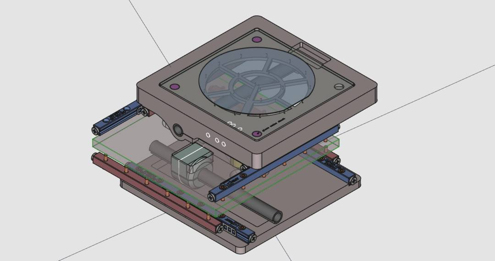

> [!CAUTION]
>
> This project is still under development, and is not yet ready for reproduction. Star or watch the repository if you want to be the first to know about a first release. 

# Linear shaft motor stage 🧲

Hardware design of a Linear Induction Motor. Uses circumferential coil arrangement (a.k.a. 'linear shaft motor'). The design is intended to be used as an  'XY-stage' for a lithography machine or other applications with precision position requirements but light load.

Target features

* ~1 Micron position (measurement) accuracy or better
* Ability to stack design for two linear movement axes
* ~110mm travel range
* Open Hardware. Designed from parts that can be sourced.

> [!IMPORTANT]
>
> The binary files in this repository (FreeCAD files, etc) are managed with Git-Annex. When you clone this repo they will not immediately be available. You will need to install Git-Annex on your system and then run `git-annex get .` to download these files.

### Hardware overview 🛍

There are 3 elements that are key to a linear induction stage. Considerations and selection motivations can be found on the linked wiki sections.

* [Linear guidance system](https://github.com/openMLA/linear-shaft-motor/wiki/linear-guidance) ⚙. The mechanical constraints that constrain motion along a single direction. Think linear rails and so on. 
* [Linear induction motor](https://github.com/openMLA/linear-shaft-motor/wiki/induction-motor) 🧲. The magnets and coil assembly that are able to produce the forces required for the stage to move along it's constrained motion path.
* [Encoder and feedback circuit](https://github.com/openMLA/linear-shaft-motor/wiki/encoder-and-feedback) 💻. Components that sense the system's position and use this information to drive the linear motor to target location.

Of course there is also the brackets and mounting surfaces that are required to ensure these pieces all fit together.

### Linear induction motor geometries 🔠

There are 3 categories of linear induction motors:

* Flat motors (flat magnets only on one side of forcer) 
* I-beam motors (flat magnets on both sides of forcer)
* Shaft motors (cylindrical magnets with forcer wrapped around magnets)

There are advantages and disadvantages to each geometry. This [video  by  WSM Technology INC 🎥](https://www.youtube.com/watch?v=Bxs2PFg0luw) is a good starting point. It primarily is listing advantages of Shaft motors (as used in this project), but doesn't really go into the downsides of the shaft geometry. I think that the primary disadvantage is that the shaft motor is a pretty bulky design, and in space-constrained applications it may not be ideal. This kind of project would actually be a good fit for flat or I-beam geometries as the space below the stage is quite wide, and a linear-shaft design is not using that space efficiently.

### Bill of materials 📃💸

You can find the BOM as a CSV file in this repository. Note that this BOM.csv is generated from another CSV in the `./components` directory.

### Similar projects 👨‍❤️‍👨

Besides the many commercial vendors of induction motors of the various kinds (shaft, flat, and I-beam), there have also been various DIY attempts at such motors. They are impressive efforts, and were very effective in demonstrating the feasibility of the concept. Vulcaman's project can and has even been reproduced by another user.

* [Linear Shaft Motor by tyler mccollum (GitHub)](https://github.com/tylermccollum/LinearMotor) - Uses a bearing inside the motor itself, rather than relying on external rails. 
* [Linear shaft motor with cmore839 (GitHub)](https://github.com/cmore839/DIY-Linear-Motor) - Project with multiple collaborators that aims to develop solution that can be implemented in various settings (3D printers, pick and place, etc) 
* [Vulcaman's I-beam linear motor (Instructables)](https://www.instructables.com/DIY-IRONLESS-LINEAR-SERVO-MOTOR/) - I-beam linear motor, uses quite a bit of CNC machined elements
* [TkkrLab's I-beam linear motor (GitHub)](https://github.com/TkkrLab/LinearMotor) - I-beam linear motor, inspired by the project above. Some videos [available on YouTube](https://www.youtube.com/watch?v=bwdEMA3n0Z4).
* [Bzaz_31 linear shaft beam motor (YouTube)](https://www.youtube.com/watch?v=-LRr727emjQ) - Linear shaft motor and RLC magnetic encoder.
* [Ben Wang's I-beam PCB linear motor (Blog)](https://benwang.dev/2022/08/09/PCB-Linear-Actuator.html) - I-beam linear motor **Using PCB coils for the forcer 😎**

*If there are any cool projects I have missed, let me know!*